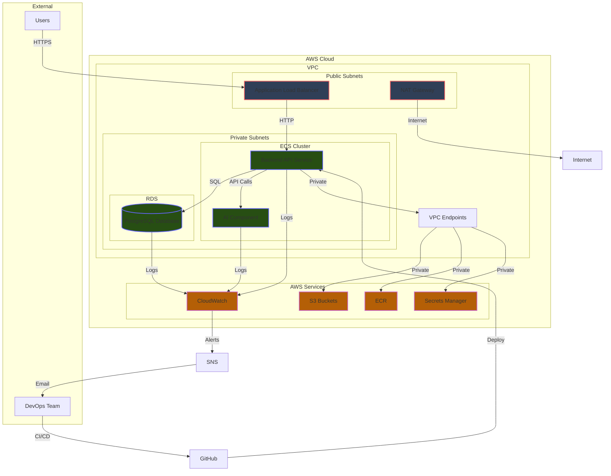

# Architecture Diagram

The following diagram illustrates the high-level architecture of this Infrastructure.

```mermaid
graph TD
    subgraph "AWS Cloud"
        subgraph "VPC"
            subgraph "Public Subnets"
                ALB[Application Load Balancer]
                NAT[NAT Gateway]
            end
            
            subgraph "Private Subnets"
                subgraph "ECS Cluster"
                    API[Backend API Service]
                    AI[AI Component]
                end
                
                subgraph "RDS"
                    DB[(PostgreSQL Database)]
                end
            end
            
            VPCEndpoints[VPC Endpoints]
        end
        
        subgraph "AWS Services"
            S3[S3 Buckets]
            CloudWatch[CloudWatch]
            SecretsManager[Secrets Manager]
            ECR[ECR]
        end
    end
    
    subgraph "External"
        Users[Users]
        DevOps[DevOps Team]
    end
    
    Users -->|HTTPS| ALB
    ALB -->|HTTP| API
    API -->|SQL| DB
    API -->|API Calls| AI
    API -->|Logs| CloudWatch
    AI -->|Logs| CloudWatch
    DB -->|Logs| CloudWatch
    
    API -->|Private| VPCEndpoints
    VPCEndpoints -->|Private| S3
    VPCEndpoints -->|Private| ECR
    VPCEndpoints -->|Private| SecretsManager
    
    DevOps -->|CI/CD| GitHub
    GitHub -->|Deploy| API
    
    CloudWatch -->|Alerts| SNS
    SNS -->|Email| DevOps
    
    NAT -->|Internet| Internet
    
    classDef public fill:#124d,stroke:#f66,stroke-width:2px
    classDef private fill:#274e13,stroke:#66f,stroke-width:2px
    classDef service fill:#b45f06,stroke:#c6c,stroke-width:2px
    
    class ALB,NAT public
    class API,AI,DB private
    class S3,CloudWatch,SecretsManager,ECR service
```
